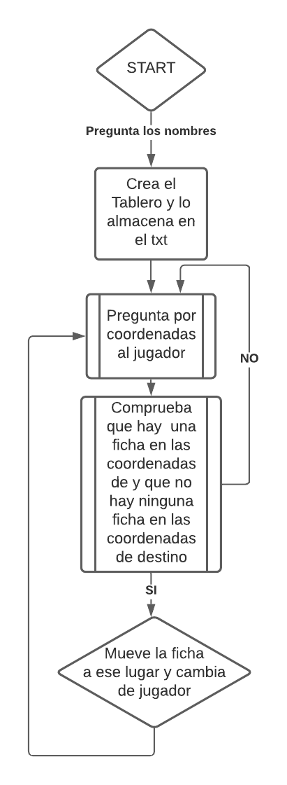

# Ajedrez
El siguiente repositorio corresponde al ejercicio de Ajedrez para la Asignatura de Fundamentos de programación y computadores.

---

La dirección del Repositorio es la siguiente: [Ajedrez](https://github.com/mat0ta/ajedrez)

He creado un código capaz de generar un tablero de Ajedrez, colocando las fichas correspondientes en el mismo y guardarlo en un archivo formato txt. Antes de crear el tablero, pregunta los nombres de los jugadores que van a competir, los cuales los almacena en una variable de la clase Ajedrez. 
Acto seguido, el juego pregunta que ficha querrá mover el primer jugador (Blancas). Este deberá introducir las coordenadas en las que se encuentre una ficha y tendrá que moverla a un espacio vacío. El programa comprueba que las coordenadas introducidas son en efecto las coordenadas de una ficha existente y que en las coordenadas de destino no haya ninguna ficha.
Dichos movimientos quedan registrados en el archivo txt.

El [diagrama de flujo](./assets/diagrama.png) que sigue el código es el siguiente:

